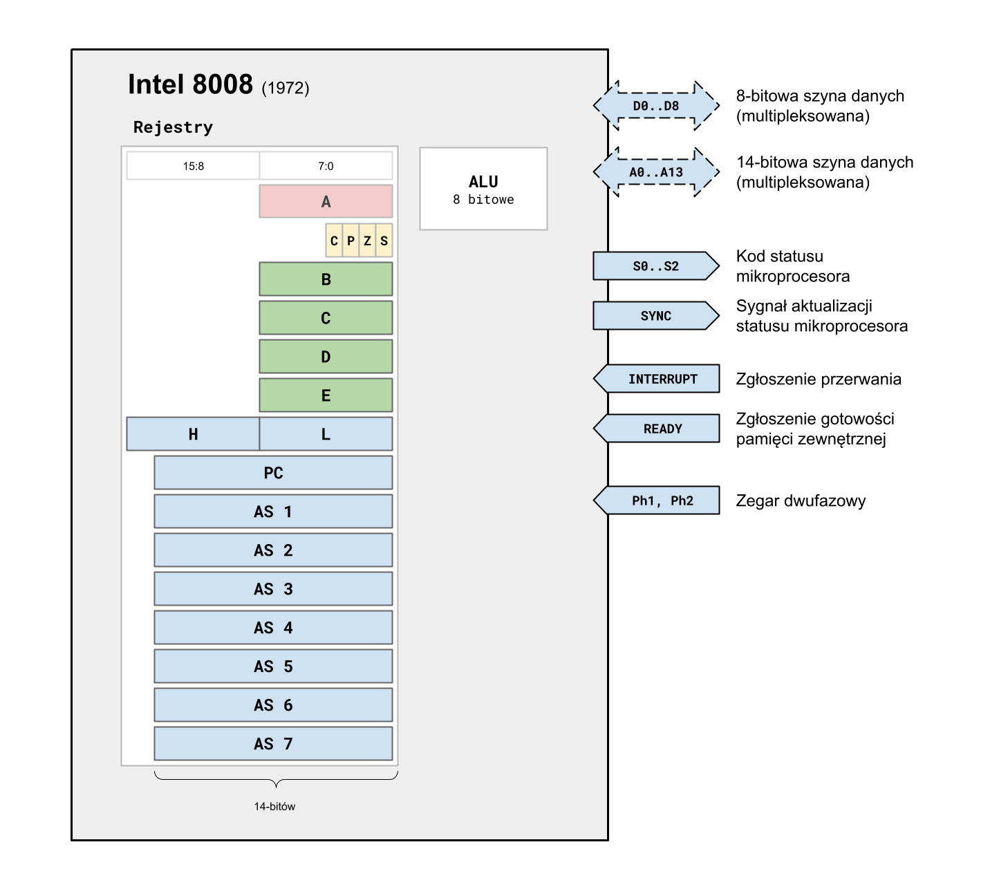
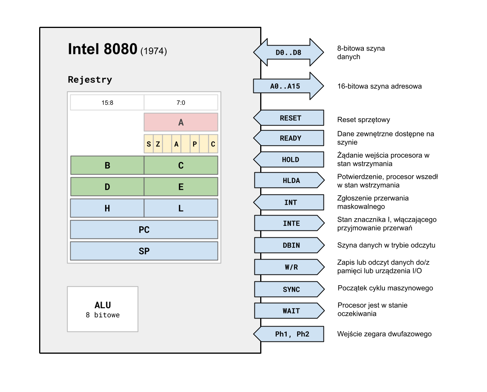
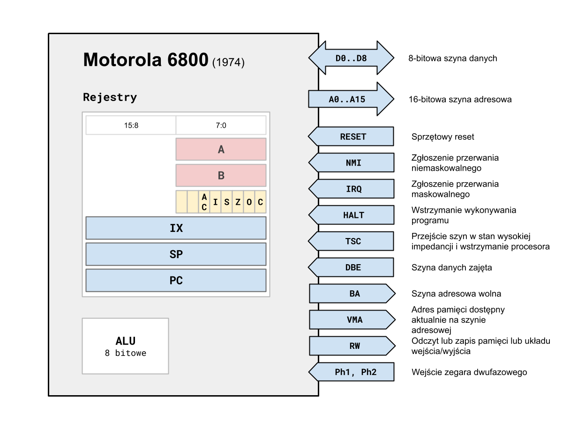
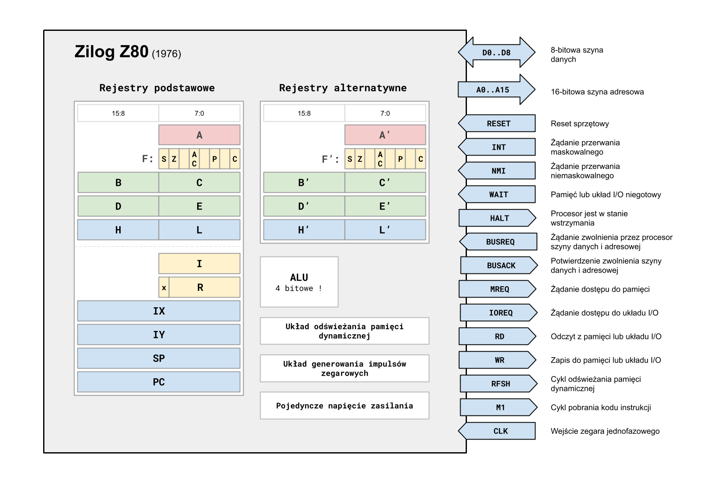
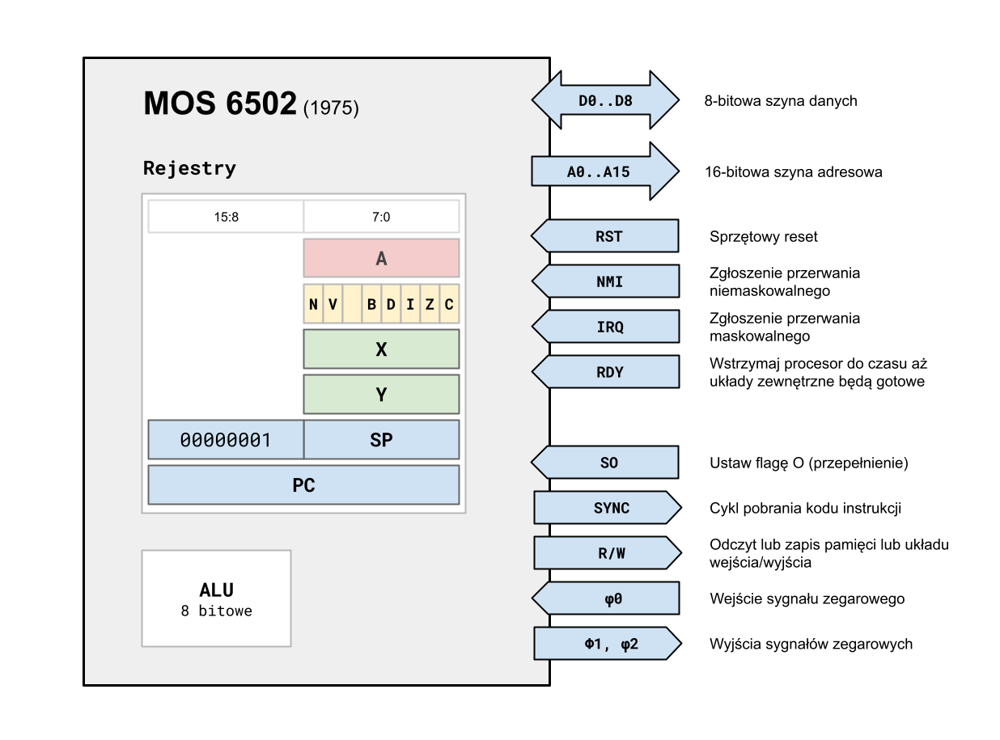

# 8-bitów: Intel, Motorola i inni ...

Wprowadzenie mikroprocesorów na rynek komercyjny na początku lat 70-tych XX wieku  zaowocowało powstaniem najrozmaitszych systemów komputerowych, oferowanych przez wielkie firmy, jak i „garażowych”, niszowych hobbystów. Szczególnie konstrukcje 8-bitowe, jako stosunkowo proste i tanie, wyzwoliły twórczy potencjał konstruktorów. Rozgrzały także rywalizację o rynek wśród producentów mikroprocesorów.

## Korzenie

Często dzieje się tak, że decyzje podjęte w początkowej fazie projektu, jeśli nie są skorygowane w krótkim czasie, powodują dalekosiężne i nie dające się usunąć konsekwencje. To stwierdzenie jest szczególnie prawdziwe w odniesieniu do wszelkiego rodzaju projektów IT, zwłaszcza gdy w grę wchodzi również komponent sprzętowy. Ewolucja mikroprocesorów jest tego dobrym przykładem.

Podejście taktyczne, zdominowane przez chęć szybkiego poradzenia sobie z aktualnymi problemami w sposób najbardziej efektywny biznesowo, prowadzi do wytworzenia poręcznych i efektywnych rozwiązań, które można wykorzystać niemal od razu do rozwiązywania praktycznych zadań. Takie podejście zdominowało projekty mikroprocesorów firmy Intel, począwszy od pierwszego z nich, czyli i4004. Owocem takiego podejścia jest osiągnięcie w krótkim terminie przewagi na konkurencyjnym rynku. Sytuacja jednak ciągle podlega zmianom, a rozwiązania tworzone dla specyficznych potrzeb zazwyczaj trudno jest dostosować, a na pewno trudno jest zrobić to bez stopniowej degradacji pierwotnego zamysłu. Chcąc utrzymywać zgodność z istniejącymi, stworzonymi ad-hoc rozwiązaniami, trzeba dźwigać brzemię poprzednich decyzji projektowych. To, co było skuteczne przy rozwiązywaniu konkretnych problemów z przeszłości, może stać się zbędnym balastem przy opracowywaniu nowych projektów. Z czasem kolejne aktualizacje zawierają coraz więcej „protez” i „obejść” pozwalających sprostać oczekiwaniom, jednak w sposób coraz mniej efektywny i przejrzysty. Dodawane są nowe funkcje, lecz stare wciąż są dostępne, zwiększając bardzo poziom komplikacji projektu. Wskutek wzrostu złożoności wzrasta szansa wystąpienia błędów, które nie zostaną w porę wykryte. Rośnie też koszt utrzymania i konserwacji, a w przypadku mikroprocesorów wzrasta ilość tranzystorów, pobór mocy, a tym samym maleje  maksymalna częstotliwość taktowania.

Alternatywna metoda to podejście, które można by nazwać bardziej „strategicznym” czy długofalowym. To sposób na generalizację i dostarczenie elastycznego rozwiązania dla pewnej klasy problemów, bez konieczności tworzenia narzędzi i metodologii specyficznych tylko dla konkretnego przypadku. Takie podejście wymaga więcej planowania, zajmuje więcej czasu i w związku z tym pojawia się później, dając się wyprzedzić innym, bardziej praktycznym i szybszym w implementacji rozwiązaniom. W długim okresie jednak zazwyczaj wygrywa elastycznością podejścia i bardziej eleganckim charakterem rozwiązania. To jest droga, którą zdaniem autora wybrali projektanci firmy Motorola. Elegancja nie jest tylko pojęciem z dziedziny mody, jest określeniem projektu, który jest czytelny, ma dobrze zdefiniowaną strukturę oraz przyporządkowanie funkcjonalności swoim komponentom. Taki projekt najczęściej jest względnie łatwo rozszerzalny, tani w utrzymaniu oraz adaptacji do różnych, czasem nieoczekiwanych potrzeb. Najczęściej jeż też mniej skomplikowany, a co za tym - idzie mniej podatny na błędy wynikające z samej  złożoności.

Wiele zależy też od przypadku i od tego, kto i w jakim czasie rozpoczął proces projektowania. Wybór prototypu na którym, z wyboru czy z konieczności, projektanci oparli swoją koncepcję ma również duże znaczenie.

Aby móc w jakiś sposób ocenić liczbowo efektywność danej architektury, zaproponowano wprowadzenie autorskiego współczynnika o tej właśnie nazwie. Jest on zdefiniowany w następujący sposób:

$$\text{efektywność architektury} = \frac{\text{ilość 64-bitowych dodawań na sekundę}}{\text{ilość tranzystorów w tysiącach}}$$

Jego wartość zostanie podana w specyfikacji każdego omawianego mikroprocesora. 

W specyfikacjach, przy podawaniu dostępnych trybów adresowania, nie dokonano rozróżnienia dla trybów z adresem 8- i 16-bitowym, co na potrzeby niniejszego artykułu uznano za niepotrzebną komplikację. 

## Droga Intela

Firma Intel zaprezentowała pierwszy, komercyjnie dostępny mikroprocesor: model i4004. Było to w 1971 roku i jego projekt był odpowiedzią na konkretny biznesowy problem, mianowicie na konieczność zastąpienia skomplikowanej i drogiej logiki kalkulatora Busicom czymś, co byłoby tańsze i jednocześnie mogące podlegać modyfikacjom w przyszłości. Architektura i4004 była zorientowana na przetwarzanie cyfr, co miało odbicie w wielu aspektach projektu. 

Jednocześnie w firmie Intel opracowywano projekt bardziej zaawansowanego mikroprocesora, w pełni 8-bitowego i8008. Mikroprocesor ten był wzorowany na jednostce centralnej komputera osobistego Datapoint 2200 produkowanego przez firmę Computer Terminal Corporation (CTC). Był to w zasadzie uniwersalny terminal służący do łączenia się z komputerami klasy Mainframe różnego typu, w zależności od aktualnie załadowanego protokołu komunikacyjnego. Firma CTC początkowo nie zdawała sobie sprawy z uniwersalnego charakteru produktu, który miała w swojej ofercie. Po dostrzeżeniu potencjału rynkowego zleciła, między innymi firmie Intel, zaprojektowanie i wyprodukowanie funkcjonalnego odpowiednika ich własnej jednostki centralnej, wykonanej wtedy w oparciu o bipolarne układy TTL. 

Temu właśnie miał służyć projekt Intel 8008, nie został jednak dostarczony na czas i okazał się ostatecznie zbyt wolny. Istniejąca jednostka centralna Datapoint oferowała większą wydajność niż  i8008, projekt został więc odrzucony. Firma Datapoint (wcześniej CTC) do 1979 roku oferowała w dalszym ciągu swój model 2200 oparty na układach scalonych TTL. W ten sposób Intel pozostał właścicielem projektu  i8008, który nie zarobił na siebie ani dolara, ale mógł być teraz zaoferowany na rynku jako produkt komercyjny. 

Historia początków mikroprocesorów Intela to udana próba uczynienia technologii rodem ze świata kalkulatorów i terminali technologią uniwersalnych komputerów osobistych. Przypadek i8008 pokazał, że można stworzyć mikrokomputer  uniwersalny i tani na tyle, że będzie mógł pełnić samodzielnie pewne funkcje i stać się czymś więcej niż tylko terminalem dla maszyn o większej mocy obliczeniowej.


Rysunek 1. Schemat blokowy mikroprocesora Intel i8008

Jest to konstrukcja praktycznie w 100% zgodna z jednostką centralną komputera/terminala Datapoint 2200. Architektura tej jednostki centralnej, w wersji wykorzystanej jako baza dla i8008, wyglądała następująco:

`rejestr A` - 8-bitowy akumulator i rejestr dedykowany do transferów między jednostką centralną a pamięcią zewnętrzną lub portami wejścia/wyjścia.

`rejestry H, L` - dwa 8-bitowe rejestry, których głównym przeznaczeniem jest adresowanie pamięci i portów, w tym celu występują jako para, a adresowana przez nie komórka pamięci jako wirtualny rejestr M. Mogą być także używane, również osobno, jako rejestry ogólnego przeznaczenia.

`rejestry B, C, D, E` - rejestry ogólnego przeznaczenia.

`rejestr P` - 13-bitowy licznik programu.

Widzimy tutaj uderzające podobieństwo do i8008 i jego zestawu rejestrów. Jak zobaczymy w dalszej części artykułu, ten model architektury jest charakterystyczną cechą rodziny mikroprocesorów firmy Intel i pozostał z nami do dzisiaj. 

Intel 8008 był konstrukcją hybrydową, z jednej strony obciążoną wymaganiami Datapoint 2200, a z drugiej czerpiącą inspiracje z projektu i4004. Pewnym krokiem w stronę większej elastyczności było przyjęcie bardziej regularnego adresowania pamięci niż w 4-bitowym poprzedniku. Z drugiej strony zintegrowany w strukturze CPU stos adresowy, w formie cyklicznego bufora, był widocznym zapożyczeniem z poprzednich konstrukcji. W tamtym czasie zarząd Intela postrzegał systemy mikroprocesorowe jako rozwiązania konkretnych, specyficznych problemów sterowania. W takim paradygmacie nie ma miejsca na uniwersalność i elastyczność, a kod programu jest zazwyczaj na stałe utrwalony w pamięci ROM. Proste systemy, na których był wzorowany, były zazwyczaj jednowątkowe, dlatego nie dołożono starań, by zaprojektować wygodny system przerwań. Dostępne było tylko jedno, niemaskowalne przerwanie, co w połączeniu z ograniczonym, sprzętowym stosem adresowym utrudniało jego wygodne wykorzystanie.

Koncepcja komputera osobistego ogólnego przeznaczenia, opartego na mikroprocesorach Intel, z trudem znajdowała drogę do umysłów zarządzających tą korporacją. Specyfikacja i8008, przedstawiona poniżej, pozwalała jednak, pomimo swoich braków, na zbudowanie  wszechstronnego systemu.

|                               |                                                      |
| ----------------------------- | ---------------------------------------------------- |
| rok wprowadzenia do produkcji | 1972                                                 |
| ilość tranzystorów            | 3500                                                 |
| częstotliwość taktowania      | 0.5 MHz (cykl zegarowy: 2 μs)                        |
| cykl instrukcji               | 20 - 44 μs (10–22 cykli zegarowych)                  |
| indeks prędkości              | 0.050 MIPS                                           |
| dodawanie 64-bitowe           | 285 / s                                              |
| efektywność architektury      | 81                                                   |
| rozmiar danych                | 8-bit                                                |
| rozmiar instrukcji            | 1..3 bajty                                           |
| licznik programu              | 14-bit                                               |
| stos                          | wbudowany bufor cykliczny dla 7 adresów (7 x 14-bit) |
| rejestry ogólne               | 7 x 8-bit                                            |
| akumulator                    | 8-bit                                                |
| znaczniki                     | C P Z S                                              |
| adresowanie pamięci           | 16 KiB (14-bit adres)                                |
| adresowanie I/O               | we: 8 x 8-bit, wy: 24 x 8-bit                        |
| przerwania                    | niemaskowalne                                        |
| tryby adresowania             | 4                                                    |
| architektura                  | von Neumanna                                         |

Potencjał tego mikroprocesora został wykorzystany przez niezależnych projektantów i konstruktorów. Komputer ogólnego przeznaczenia oparty na i8008 powstał w 1973 roku. Był to projekt MICRAL, którego twórcą był Thi T. Truong, imigrant z Wietnamu, który we Francji otworzył firmę zajmującą się elektroniką. Była to jak na owe czasy dobrze przemyślana i uniwersalna konstrukcja, stanowiąca kompletny system wyposażony w gniazda rozszerzeń. W założeniu miała zastępować minikomputery w prostszych systemach kontroli i sterowania. Kolejnym przykład to komputer zaprojektowany przez hobbystę, był to Mark-8 z 1974 roku. Prawdopodobnie pojawienie się MICRAL-a i konstrukcji w rodzaju Mark-8 zainspirowało (lub zmusiło) kierownictwo Intela do dostrzeżenia innych, bardziej uniwersalnych zastosowań mikroprocesorów. 

W celu porównania wydajności z innymi mikroprocesorami oraz zaprezentowania modelu programowego poniżej przedstawiono krótki program dodający dwie liczby 64-bitowe. Podobny program zostanie pokazany dla każdego omawianego dalej mikroprocesora. W prawej kolumnie, obok każdego wiersza kodu, podana jest liczba cykli zegara, która potrzebna jest do jej wykonania. Pozwala to w pewien sposób ocenić cechy danej architektury, choć nie można z samej tylko liczby cykli zegara wyciągać zbyt daleko idących wniosków. Zegar może być wykorzystywany przez mikroarchitekturę w różny sposób, co przekłada się na jego maksymalną częstotliwość dla danej konstrukcji. Liczby te jednak, w połączeniu z ogólnym wyglądem kodu, pozwalają wyrobić sobie pewne pojęcie na temat cech charakterystycznych danego mikroprocesora.

```
; Intel 8008 (i8008)
; dodawanie dwóch liczb 64-bitowych
; ARGH - bardziej znaczący bajt adresu buforów
; ARGL0,1 - mniej znaczące bajty adresu buforów argumentów
; Dla uproszczenia kodu bufory muszą mieć takie same bardziej znaczące adresy
; oraz nie przekraczać granicy pełnych 256 bajtów.
; Liczby w nawiasach, w komentarzu, oznaczają ilość cykli na daną instrukcję.

  MOV H, ARGH   ; (16) ładuj ARGH do rejestru H
  XRA           ; (10) zeruj akumulator
  MOV C, A      ; (10) zeruj rejestr C (indeks bajtu)
  MOV E, A      ; (10) zeruj rejestr E (przeniesienie)
  MVI D, 8      ; (16) ładuj do D długość argumentów w bajtach
NAST: 
  MVI A, ARGL0	; (16) ładuj do akumulatora LSB argumentu 0
  ADD A, C      ; (10) dodaj do A aktualny indeks bajtu
  MOV L, C      ; (10) H,L zawiera adres bieżącego bajtu argumentu 0
  MOV B, M      ; (16) ładuj do B bieżący bajt argumentu 0
  MVI A, ARGL1  ; (16) ładuj do akumulatora LSB argumentu 1
  ADD A, C      ; (10) dodaj do A aktualny indeks bajtu
  MOV L, C      ; (10) H,L zawiera adres bieżącego bajtu argumentu 1
  MOV A, E      ; (10) odtwórz aktualną wartość przeniesienia (bit 0)
  RAR           ; (10) wpisz tą wartość do znacznika C
  MOV A, M      ; (16) ładuj do akumulator bieżący bajt argumentu 1
  ADC B         ; (10) i wreszcie dodaj oba bajty z przeniesieniem
  MOV M, B      ; (16) rezultat zapisz w miejsce bajtu argumentu 1
  RAL           ; (10) wpisz wartość znacznika C do bitu 0 akumulatora
  MOV E, A      ; (10) zachowaj wartość przeniesienia w rejestrze E
  INR C         ; (10) zwiększ licznik bajtów o 1
  DCR D         ; (10) zmniejsz licznik długości o 1
  JNZ NAST      ; (22) jeśli nie wszystkie bajty, kontynuuj
```
Zliczając czasy wykonania wszystkich instrukcji, mamy 62 + 8 x 212 - 4 (ostatni skok warunkowy nie zachodzi) = **1754** cykli zegara. Ostatecznie więc czas wykonania to około 3.5 ms, co daje około 285 takich operacji na sekundę. 

Brak adresowania z indeksem, adresowanie pośrednie ograniczone tylko do wykorzystania pary rejestrów HL powoduje, że kod tak prostej operacji jest wyjątkowo skomplikowany i długi. Operacje arytmetyczne na adresie przeplatają się z właściwym dodawaniem, wymusza to konieczność każdorazowego zapisania i odczytania wartości przeniesienia, a to wydłuża i komplikuje kod jeszcze bardziej. Z tych powodów - oraz stosunkowo wolnego zegara - proste 64-bitowe dodawanie trwa ponad dwukrotnie wolniej niż przy użyciu 4-bitowego mikroprocesora Intel 4004 !!! Liczona według podanej wcześniej metodologii „efektywność architektury” dla i4004 wynosi 266, więc jest ponad trzykrotnie większa (a więc lepsza) od i8008.

Prezentowane fragmenty kodu, wykorzystywane jako benchmark, mogłyby, być może, zostać napisane w sposób nieco bardziej wydajny. Na przykład przez wyeliminowanie pętli i licznika bajtów, powielając po prostu dodawanie wymaganą ilość razy. Nieprzypadkowo tego rodzaju techniki “optymalizacji” nie zostały użyte. Kod napisany w sposób regularny, przy użyciu pętli, pozwala lepiej oddać cechy dostępnego modelu programowego. Do obliczenia czasu wykonania wykorzystano maksymalną częstotliwość zegara jaką oferował podstawowy model danego procesora. Zazwyczaj już podczas debiutu, lub tuż po nim, oferowane były modele o podwyższonych parametrach, jednak dla ujednolicenia wyników zdecydowano się nie brać ich pod uwagę.

Rynek mikroprocesorów otworzył nowe możliwości budowy tanich i w miarę wydajnych mikrokomputerów osobistych. Intel przyjął drogę rozwoju swoich projektów poprzez rozszerzanie i rozbudowywanie rozwiązań prostych i wyspecjalizowanych. Nie inaczej było z kolejną konstrukcją, i8080, która tym razem stała się rynkowym przebojem. Zachowano w niej koncepcyjną zgodność z poprzednikiem, przy zachowaniu niemal całkowitej zgodności modelu programowego, jednak bez kompatybilności binarnej. 


Rysunek 2. Schemat blokowy mikroprocesora Intel i8080

Rejestry, które mogą być łączone w pary w celu osiągnięcia większej długości słowa, zostały na schematach blokowych ustawione w poziomie, obok siebie. Jak widać, pomimo zachowania praktycznie identycznego zestawu rejestrów ich funkcjonalność została znacznie rozszerzona. Nie tylko rejestry H i L ale również B, C i D, E mogą być łączone w pary. Takie 16-bitowe pary mogą być w ograniczonym zakresie wykorzystywane jako pojedynczy rejestr. W ten sposób można za pomocą jednej instrukcji załadować 16-bitową wartość w trybie natychmiastowym, można też dokonać inkrementacji i dekrementacji takiej pary. Istnieje również instrukcja DAD realizująca 16-bitowe dodawanie, gdzie rolę akumulatora spełnia para HL, a drugiego operandu para BC, DE lub wskaźnik stosu SP.

Rejestr znaczników został wzbogacony o tak zwane przeniesienie pomocnicze, czyli przeniesienie z mniej znaczącego półbajtu (ang. *nibble* - czterobitowe słowo). Pozwala to na uproszczenie procedur operujących na liczbach dziesiętnych kodowanych binarnie (ang. *Binary Coded Decimal* - BCD).

W pełni 16-bitowy rejestr PC, czyli licznik programu, pozwalał w końcu na zaadresowanie pełnych 64 KiB pamięci. Na uwagę zasługuje usunięcie z rdzenia cyklicznego bufora rejestrów adresowych, spełniającego rolę stosu. Zamiast tego dodany został wskaźnik stosu SP zawierający adres jego wierzchołka. Stos mógł być więc umieszczony gdziekolwiek w pamięci, można było też przez zmianę wartości SP utworzyć wiele niezależnych stosów. W połączeniu z instrukcjami PUSH i POP znacznie łatwiejsze było jego wykorzystanie w obsłudze wywołań podprogramów czy procedurach obsługi przerwań.

Sama obsługa przerwań została również znacznie rozbudowana, lecz jej potencjał nie mógł zostać wykorzystany bez zastosowania zewnętrznych układów wspomagających. Dostępne było tylko przerwanie maskowalne z możliwością określenia maksymalnie ośmiu wektorów (adresów) dla różnych procedur obsługi. Uproszczona została również komunikacja z urządzeniami i układami zewnętrznymi, zastosowano nie-multipleksowaną 16-bitową szynę danych i osobną 8-bitową szynę adresową. W dalszym ciągu jednak sygnał zegarowy musiał być dwufazowy, a zasilanie wymagało podania trzech różnych napięć. Sam system więc wciąż był dosyć złożony, jednak postęp względem i8008 był znaczny.

Podstawowa specyfikacja i8080 przedstawiona jest poniżej.

|                               |                                    |
| ----------------------------- | ---------------------------------- |
| rok wprowadzenia do produkcji | 1974                               |
| ilość tranzystorów            | 6000                               |
| częstotliwość taktowania      | 2.0 MHz (cykl zegarowy: 0.5 μs)    |
| cykl instrukcji               | 2 - 9 μs (4 - 18 cykli zegarowych) |
| indeks prędkości              | 0.5 MIPS                           |
| dodawanie 64-bitowe           | 5012 / s                           |
| efektywność architektury      | 835                                |
| rozmiar danych                | 8-bit                              |
| rozmiar instrukcji            | 1..3 bajty                         |
| licznik programu              | 16-bit                             |
| stos                          | 16-bit wskaźnik stosu              |
| rejestry ogólne               | 7 x 8-bit                          |
| akumulator                    | 8-bit                              |
| znaczniki                     | C P Z S AC                         |
| adresowanie pamięci           | 64 KiB (16-bit adres)              |
| adresowanie portów            | we/wy: 256 x 8-bit                 |
| przerwania                    | maskowalne                         |
| tryby adresowania             | 6                                  |
| architektura                  | von Neumanna                       |

Rozbudowanie zestawu instrukcji i modelu programowego pozwoliło na tworzenie znacznie bardziej zwartego i wydajnego kodu niż było to możliwe w przypadku poprzedniego i8008. Widać to wyraźnie na przykładzie naszego benchmarku, czyli procedury dodającej dwie 64-bitowe liczby binarne.

; Intel 8080 (i8080)
; dodawanie dwóch liczb 64-bitowych
; ARG0 - adres bufora pierwszego argumentu
; ARG1 - adres bufora drugiego argumentu i wyniku
; Liczby w nawiasach, w komentarzu, oznaczają ilość cykli na daną instrukcję.

  LXI B, ARG0    ; (10) ładuj do pary B,C adres argumentu 0
  LXI H, ARG1    ; (10) ładuj do pary H,L adres argumentu 1
  XRA A          ; (4) zeruj akumulator i znacznik C
  MVI E, 8       ; (7) ustaw licznik bajtów na 8 (64 bity)
NAST: 
  LDAX B         ; (7) ładuj do A bieżący bajt argumentu 0
  ADC M          ; (7) dodaj do A bieżący bajt argumentu 1
  MOV M, A       ; (7) zapisz wynik do bieżącego bajtu argumentu 1
  INX B          ; (5) zwiększ o 1 adres bajtu argumentu 0
  INX H          ; (5) zwiększ o 1 adres bajtu argumentu 1
  DCR E          ; (5) zmniejsz o 1 licznik bajtów
  JNZ NAST       ; (10) jeśli nie wszystkie bajty, kontynuuj

Dzięki temu, że dostęp do pamięci może być realizowany w sposób pośredni, przez więcej niż jedną parę rejestrów, procedura dodawania może być znacznie prostsza niż ta dla mikroprocesora Intel 8008. Dodatkowo istnieje możliwość inkrementacji całej, 16-bitowej pary rejestrów, co oprócz dodatkowego uproszczenia kodu pozwala uniknąć operacji dodawania, która modyfikując znacznik C, wymuszałaby jego każdorazowe zapisywanie i odtwarzanie. Zliczając czasy wykonania, mamy: 31 + 8 x 46 = 399 cykli zegara. Daje to czas wykonania ~ 200 μs, czyli około 5012 dodawań na sekundę.

Możemy zaobserwować wyraźny trend w kierunku większej uniwersalizacji architektury, większego zorientowania na pamięć zewnętrzną tak modelu programowego (tryby adresowania), jak i architektury rdzenia (przesunięcie stosu do pamięci). Tak zaprojektowany mikroprocesor mógł stać się jednostką centralną komputera osobistego z prawdziwego zdarzenia. Tak też się stało. Pierwszym i chyba najbardziej znanym był Altair 8800 firmy MITS, który został zaprezentowany na początku 1975 roku. Przypominał w dalszym ciągu szafy sterownicze urządzeń przemysłowych, lecz był już pełnoprawnym 8-bitowym systemem komputerowym.


Rysunek 2. MITS Altair 8800 (źródło: https://en.wikipedia.org/wiki/Altair_8800)

Altair 8800 stał się wkrótce standardem znanym jako S-Bus 100. Był to rozszerzalny, modularny system stanowiący bazę rozwojową wielu konstrukcji z tamtych lat. Ta platforma sprzętowa, w połączeniu z systemem CP/M oraz wieloma innymi programami jak np. Altair BASIC firmy Microsoft, stała się czymś na kształt standardu PC w początkowym okresie rozwoju komputerów osobistych.

Naturalną kontynuacją i8080 stał się i8085, który był binarnie całkowicie zgodny z poprzednikiem, miał jednak kilka czysto utylitarnych innowacji. Wymagał tylko jednego napięcia zasilającego (+5V), miał zintegrowany port szeregowego wejścia-wyjścia oraz pięć niezależnych wejść zgłoszenia przerwania.

## Droga Motoroli

Projekty Motoroli powstały w oparciu o całkowicie inną koncepcję niż ta wybrana przez firmę Intel. Po części było to spowodowane tym, że pojawiły się nieco później, w związku z tym projektanci mogli uczyć się na błędach poprzedników i starać się uniknąć wchodzenia w technologiczne ślepe zaułki, z których trudno byłoby się później wycofać. Tak powstał mikroprocesor M6800. Pierwowzorem jego architektury była jednostka centralna minikomputera PDP-11 firmy DEC. Minikomputery były wówczas ogniwem pośrednim między maszynami typu Mainframe o dużej, jak na tamte czasy, mocy obliczeniowej a komputerami osobistymi, które wówczas były postrzegane jako nieco bardziej wszechstronne terminale czy też sterowniki przemysłowe. Maszyny Mainframe były najczęściej wykorzystywane w systemie pracy z podziałem czasu (ang. time share), czyli przez wielu użytkowników jednocześnie. Głównym tego powodem była wysoka cena Mainframe-ów, jak również współczynnik ceny do pojemności pamięci lub mocy obliczeniowej. Komputer z dużą pamięcią i dużą mocą obliczeniową, pomimo swojej ceny, oferował przy współdzieleniu zasobów i tak niższą cenę za użytą moc czy pamięć niż dedykowana, mniejsza maszyna. Gdy minikomputery stały się tańsze, rachunek ekonomiczny pozwolił na wykorzystywanie ich jako maszyn dedykowanych do jednego zadania. Jednocześnie praca z podziałem czasu była w dalszym ciągu możliwa. Z konieczności więc architektura minikomputera musiała być elastyczna, a zestaw instrukcji jednostki centralnej uniwersalny i zorientowany na zewnętrzne zasoby.

Jest to kierunek myślenia zupełnie odwrotny od tego przyjętego przez firmę Intel. Pozwala uniknąć wielu pułapek specjalizacji, choć niekiedy kosztem większego nakładu pracy w procesie projektowania. Pierwszą cechą projektów wychodzących od generalizacji jest zazwyczaj prostota.


Rysunek 3. Schemat blokowy mikroprocesora Motorola M6800

Na przykładzie programu dodającego liczby mogliśmy zaobserwować, jak dostępność elastycznych, indeksowanych trybów adresowania wpływa na zwartość, czystość i wydajność kodu. Powyższa architektura już na pierwszy rzut oka różni się od tych przedstawionych wcześniej.

Pierwsza różnica to dwa niezależne 8-bitowe akumulatory, rozwiązanie rzadko spotykane w prostych konstrukcjach, lecz często widziane w bardziej złożonych, gdzie akumulatorem może być praktycznie każdy rejestr. Daje to bardzo dużą swobodę w wykonywaniu operacji arytmetyczno-logicznych. Operacje takie w większości mogły być również wykonywane bezpośrednio na komórkach pamięci, co rekompensowało brak rejestrów ogólnego przeznaczenia w samym procesorze. Dodatkowym udogodnieniem w operacjach arytmetycznych jest znacznik O (ang. overflow - przepełnienie), który w odróżnieniu od C (ang. carry - przeniesienie) poprawnie sygnalizuje fakt, że wynik operacji na liczbach ze znakiem nie mieści się w docelowych 8-miu bitach. Dostępny jest również znacznik AC, czyli przeniesienie pomocnicze (ang. *auxiliary carry*).

Widzimy też obecność 16-bitowego rejestru indeksowego IX oraz niemultipleksowaną szynę adresową oraz danych. Rejestr programu PC ma pełne 16 bitów, dostępny jest też niezależny wskaźnik stosu pozwalający na umieszczenie go w dowolnym miejscu przestrzeni adresowej. Charakterystyczną cechą architektury M6800 jest szybki dostęp do tzw. strony zerowej pamięci (ang. zero page), czyli obszaru 0x00 - 0xFF. Daje to wydajny dostęp do 256 quasi-rejestrów ogólnego przeznaczenia. 

Sam rdzeń jest, jak widać, prosty, co przekłada się na intuicyjny model programowy i regularną listę rozkazów. W M6800 dodatkowym uproszczeniem jest rezygnacja z osobnej przestrzeni dla portów wejścia/wyjścia, muszą one być umieszczone w przestrzeni adresowej pamięci. Wadą takiego rozwiązania jest najczęściej konieczność stosowania zewnętrznych układów dekodujących adres i ewentualnego wprowadzania dodatkowych cykli oczekiwania na informację z portów.

Specyfikacja tego mikroprocesora pokazana jest poniżej.

|                               |                                   |
| ----------------------------- | --------------------------------- |
| rok wprowadzenia do produkcji | 1974                              |
| ilość tranzystorów            | 4100                              |
| częstotliwość taktowania      | 1.0 MHz (cykl zegarowy: 1 μs)     |
| cykl instrukcji               | 2 - 12 μs (2–12 cykli zegarowych) |
| indeks prędkości              | 0.5 MIPS                          |
| dodawanie 64-bitowe           | 4524                              |
| efektywność architektury      | 1103                              |
| rozmiar danych                | 8-bit                             |
| rozmiar instrukcji            | 1..3 bajty                        |
| licznik programu              | 16-bit                            |
| stos                          | 16-bit wskaźnik stosu             |
| rejestry                      | 2 x indeks 16-bit                 |
| akumulator                    | 2 x 8-bit                         |
| znaczniki                     | H I N Z O C                       |
| adresowanie pamięci           | 64 KiB (16-bit adres)             |
| adresowanie I/O               | wspólne z adresowaniem pamięci    |
| przerwania                    | niemaskowalne, maskowalne         |
| tryby adresowania             | 6                                 |
| architektura                  | von Neumanna                      |

Kod dla procesora M6800 jest przejrzysty i zwięzły, co widać  na przykładzie poniższego benchmarku. Prosty model programowy (ang. Instruction Set Architecture - ISA) wymusza w pewien sposób styl programowania. Dodatkowym atutem są instrukcje skoków warunkowych (ang. branch), które operują 8-bitowym adresem względnym, przez co są krótsze i szybsze w wykonaniu.

```
; Motorola 6800 (M6800)
; dodawanie dwóch liczb 64-bitowych
; ARG0 - 8-bitowy adres bufora pierwszego argumentu
; ARG1 - 8-bitowy adres bufora drugiego argumentu i wyniku
; bufory muszą w całości mieścić się w zakresie adresów 0x00-0xFF
; Liczby w nawiasach, w komentarzu, oznaczają ilość cykli na daną instrukcję.

  LDX #0         ; (3) zeruj rejestr indeksowy
  CLC            ; (2) zeruj znacznik C
NAST: 
  LDAA X, ARG0   ; (5) ładuj do A bieżący bajt argumentu 0
  ADCA X, ARG1   ; (5) dodaj do A bieżący bajt argumentu 1
  STAA X, ARG1   ; (6) zapisz wynik do bieżącego bajtu argumentu 1
  INX            ; (4) zwiększ o 1 wartość rejestru indeksowego
  CPX #8         ; (3) sprawdź, czy przetworzono wszystkie bajty
  BNE NAST       ; (4) jeśli nie, kontynuuj
```
Na pierwszy rzut oka widać przewagę elastycznej listy rozkazów zorientowanej na pamięć zewnętrzną nad obciążonym „kalkulatorowym” rodowodem projektem Intela. Jest to oczywiście prawdą tak długo, jak długo rdzeń pracuje w przybliżeniu z prędkością pamięci zewnętrznej. Zliczając ilości cykli poszczególnych instrukcji, mamy: 5 + 8 x 27 = 221 cykli zegara. Daje to sumaryczny czas około 221 μs, a więc prędkość około 4524 dodawań na sekundę. Jest to trochę wolniej od Intela 8080, lecz przy dwukrotnie wolniejszym zegarze procesora.

Motorola wprowadziła kolejne modele bazujące na zestawie instrukcji M6800 oraz nie kompatybilny z poprzednikami M6809. Była to dosyć nowatorska konstrukcja, mająca wiele elementów 16-bitowej architektury, postrzegana jest niekiedy jako etap pośredni prowadzący do mikroprocesora M68000.

## Sukcesorzy Intela

W ewolucji gatunków, pod naporem środowiska powstaje konieczność dostosowawcza. Staje się tak wtedy, gdy dostępne zasoby nie są już wystarczające dla wszystkich aktorów występujących w ekosystemie. Odpowiednikiem takiej sytuacji na rynku mikroprocesorów stało się nasycenie rynku różnego rodzaju konstrukcjami, które zaczęły między sobą konkurować o uwagę klientów. Wzbogaceni o doświadczenie pierwszych kilku lat wykorzystania mikroprocesorów, inżynierowie odpowiedzialni za ich projekty postanowili się usamodzielnić i zaprezentować doskonalsze, bardziej odpowiadające bieżącym potrzebom, konstrukcje. Nie bez znaczenia był też aspekt optymalizacji kosztów, co stało się możliwe dzięki rozwojowi technologii i zdobytej, praktycznej wiedzy. Jednym z powodów odejścia twórców z ich firm macierzystych był bardzo często bezwład i niechęć do innowacji kadr zarządzających.

I tak Federico Faggin, człowiek stojący za projektem i4004, pierwszego mikroprocesora, odszedł z firmy Intel i założył start-up, firmę Zilog. Efektem pracy jego grupy był projekt Z80, który był naprawdę udanym i wszechstronnym mikroprocesorem, a do tego w pełni binarnie kompatybilnym z i8080. Pomimo wszystkich obciążeń pochodzących od poprzednich projektów, wymuszonych wymogiem wstecznej kompatybilności, była to konstrukcja warta uwagi.

Przede wszystkim zadbano o wygodę i komfort projektantów systemów komputerowych i umieszczono układ odświeżania pamięci dynamicznej (ang. Dynamic Random Access Memory - DRAM) wewnątrz struktury mikroprocesora. Mikroprocesor wymagał do zasilania tylko jednego napięcia oraz podania jednofazowego sygnału zegara. Gdy Intel 8080 wymagał do pracy minimum dwóch dodatkowych układów wspomagających (i8224 oraz i8228), Z80 był pod tym względem samowystarczalny. Wewnętrzna architektura została wzbogacona o dodatkowy zestaw rejestrów ogólnego przeznaczenia, a lista instrukcji bardzo znacznie rozszerzona. Dodatkowy zestaw rejestrów był często wykorzystywany w procedurach obsługi przerwań, można było w ten sposób uniknąć konieczności zachowywania wartości rejestrów na stosie. Dla lepszej obsługi przerwań dodano rejestr I, zawierający bardziej znaczący bajt adresu procedury obsługi przerwania, mniej znaczący bajt adresu dostarczało urządzenie zgłaszające przerwanie. Sam tryb obsługi przerwań miał trzy różne tryby pracy.


Rysunek 4. Schemat blokowy mikroprocesora Zilog Z80

Częstym zarzutem pod adresem architektur bazujących na i8080 jest nieoptymalne wykorzystanie cykli zegara, co powoduje, że czasy wykonania instrukcji mierzone w cyklach są zazwyczaj dłuższe niż u konkurencji. Zarzut ten nie jest do końca uzasadniony, a w przypadku Z80 stał się nawet atutem. Szyny danych i adresowa nie w każdym cyklu są wykorzystywane przez procesor i mogą w tym czasie być przejęte przez inne komponenty systemu, jak np. układy DMA (ang. direct memory access - bezpośredni dostęp do pamięci). Dzięki buforowaniu szyny adresowej i danych oraz wyprowadzeniu sygnałów BUSREQ i BUSACK dostęp do szyn mógł być dodatkowo precyzyjnie koordynowany przy bardziej czasochłonnych zadaniach wymagających chwilowego wstrzymania pracy mikroprocesora.

Model programowy został wzbogacony o instrukcje arytmetyczno-logiczne operujące bezpośrednio na komórkach pamięci. Dodano również instrukcje przesyłające całe bloki danych lub wyszukujące w nich bajt o zadanej wartości. Dodano warunkowe instrukcje skoku do podprogramu oraz warunkowe instrukcje powrotu. Nowe rejestry indeksowe IX i IY pozwalały dodatkowo zwiększyć już i tak elastyczne możliwości adresowania.

Podstawowe dane podane są poniżej:

|                               |                                                   |
| ----------------------------- | ------------------------------------------------- |
| rok wprowadzenia do produkcji | 1976                                              |
| ilość tranzystorów            | 8500                                              |
| częstotliwość taktowania      | 2.5 MHz (cykl zegarowy: 0.4 μs)                   |
| cykl instrukcji               | 1.6 - 9.2 μs (4–23 cykli zegarowych)              |
| indeks prędkości              | 0.625 MIPS                                        |
| dodawanie 64-bitowe           | 5910 / s                                          |
| efektywność architektury      | 695                                               |
| rozmiar danych                | 8-bit                                             |
| rozmiar instrukcji            | 1..4 bajty                                        |
| licznik programu              | 16-bit                                            |
| stos                          | 16-bit wskaźnik stosu                             |
| rejestry ogólne               | 2 x 6 rejestrów 8-bit                             |
| rejestry indeksowe            | 2 x 16-bit                                        |
| rejestry specjalne            | wektor przerwań: 8-bit, odświeżania DRAM: 8-bit   |
| akumulator                    | 2 x 8-bit                                         |
| znaczniki                     | dwa zestawy: S Z H P/V C                          |
| adresowanie pamięci           | 64 KiB (16-bit adres)                             |
| adresowanie portów            | we/wy: 256 x 8-bit, (nieudokumentowane 16-bit)    |
| przerwania                    | niemaskowalne, maskowalne wektoryzowane (3 tryby) |
| tryby adresowania             | 9 oraz tryb pojedynczych bitów                    |
| architektura                  | von Neumanna                                      |

Z80 posiada 16-bitowe instrukcje ładowania wartości natychmiastowej do pary rejestrów. Posiada również instrukcje dodawania takich par do siebie wraz z przeniesieniem. Jednak nie są dostępne w nich tryby adresowania indeksowanego czy pośredniego, wskutek tego kod z ich użyciem wymagałby większej ilości cykli niż ten zaprezentowany poniżej.

W naszej standardowej procedurze dodawania dwóch liczb 64-bitowych widać nowy sposób zapisu mnemonicznego. Ponieważ Z80 był bezpośrednim konkurentem i8080, sytuacja prawna, wykorzystana przez firmę Intel, wymusiła stworzenie dla Z80 zupełnie innego zestawu nazw instrukcji, przy zachowaniu pełnej binarnej zgodności z i8080. Ostatecznie okazało się to pożyteczne, gdyż nowy zestaw jest bardziej konsekwentny i czytelny, podobny nieco do pierwotnego zapisu i8008, który z kolei bazował na assemblerze Datapoint 2200. Wszystkie rejestry, również pary, są explicite podane za pomocą pełnych nazw, adresowanie pośrednie oznaczone nawiasami itd. Efekt zastosowania nowego sposobu zapisu możemy obejrzeć poniżej.

```
; Zilog Z80 (Z80)
; dodawanie dwóch liczb 64-bitowych
; ARG0 - adres bufora pierwszego argumentu
; ARG1 - adres bufora drugiego argumentu i wyniku
; Liczby w nawiasach, w komentarzu, oznaczają ilość cykli na daną instrukcję.

  LD BC, ARG0    ; (10) ładuj do pary B,C adres argumentu 0
  LD HL, ARG1    ; (10) ładuj do pary H,L adres argumentu 1
  XOR A          ; (4) zeruj akumulator i znacznik C
  LD E, 8        ; (7) ustaw licznik bajtów na 8 (64 bity)
NAST: 
  LD A, (BC)     ; (7) ładuj do A bieżący bajt argumentu 0
  ADC A, (HL)    ; (7) dodaj do A bieżący bajt argumentu 1
  LD (HL), A     ; (7) zapisz wynik do bieżącego bajtu argumentu 1
  INC BC         ; (6) zwiększ o 1 adres bajtu argumentu 0
  INC HL         ; (6) zwiększ o 1 adres bajtu argumentu 1
  DEC E          ; (4) zmniejsz o 1 licznik bajtów
  JR NZ, NAST    ; (12) jeśli nie wszystkie bajty, kontynuuj
```
Jeśli chodzi o szybkość, to Z80 prezentuje się tutaj bardzo podobnie do i8080, dodając czasy wykonania, mamy: 31 + 8 x 49 = 423 cykle zegarowe. Daje to przybliżony czas wykonania 170 μs, czyli prędkość około 5910 dodawań na sekundę. O ile czas wykonania jest krótszy od i8080, to jednak ilość cykli jest nieco większa, Z80 nadrabia tutaj niedostatki architektury odrobinę szybszym taktowaniem. Z punktu widzenia efektywności architektury Z80 okazuje się jednak gorszy od i8080, co pokazuje odpowiedni współczynnik. Dokonano wielu ulepszeń, kosztem jednak znacznego wzrostu złożoności rdzenia.

Z80 okazał się spektakularnym sukcesem, dzięki zgodności z i8080 systemy na nim oparte mogły wprost skorzystać z bardzo bogatej biblioteki programów napisanych na ten mikroprocesor. Dostępny stał się również software napisany dla systemu CP/M, dla którego Z80 stał się wkrótce standardem. Odmiany Z80 funkcjonują do dziś w wielu systemach wbudowanych. W oparciu o Z80 powstało wiele legendarnych komputerów osobistych, jak przede wszystkim Sinclair ZX80, ZX81 czy ZX Spectrum. Również firma Amstrad wyprodukowała udaną serię komputerów opartych na tym mikroprocesorze.

## Sukcesorzy Motoroli

Sukces projektu M6800 skłonił grupę specjalistów pracujących nad tym projektem do udoskonalenia go i opracowania nowych modeli. Nie znalazło to jednak akceptacji w firmie Motorola, a to z kolei spowodowało, że Chuck Peedle, Bill Mensch i kilku innych inżynierów z pierwotnego zespołu projektowego zdecydowało się założyć swoją firmę. Tak powstało MOS Technologies. Motywacja i cele były tutaj podobne jak w przypadku Intela i powstałej na bazie jego pracowników firmy Zilog. Jednak ostateczny produkt, czyli MOS 6502, był owocem zupełnie innej wizji. O ile Z80 był wszechstronniejszą, bogatszą i pod każdym względem bardziej funkcjonalną wersją i8080, to MOS 6502 miał być przede wszystkim tańszy i wygodniejszy przy budowaniu systemów na nim opartych. Prostota i minimalizm, ale nie za cenę uniwersalności architektury, celem miało być lepsze dopasowanie produktu do potrzeb przy jak najmniejszym ograniczeniu funkcjonalności względem oryginału. Zdaniem autora udało się to bardzo dobrze, architekturę nowego MOS 6502 zilustrowano na Rysunku 5.


Rysunek 5. Schemat blokowy mikroprocesora MOS Technology 6502

Widać tutaj wyraźnie wpływ koncepcji mikroprocesora M6800, jednak w procesie projektowania zdecydowano się na szereg zmian.

Po analizie istniejącego kodu i potrzeb programistów stwierdzono, że należy skupić się na obsłudze struktur danych o wielkości do 256 B. W związku z tym zamiast jednego, 16-bitowego rejestru indeksowego wprowadzono dwa 8-bitowe. W ten sposób łatwo jest realizować różnego rodzaju transfery danych, jest to również szybsze. Zachowano zoptymalizowany dostęp do tak zwanej „strony zerowej”, czyli obszaru pamięci od 0x00 do 0xFF. Adresy ze strony zerowej mogły być też wykorzystywane do przechowywania adresu przy adresowaniu pośrednim, również w połączeniu z indeksowaniem za pomocą rejestrów. Dało to bardzo dużą swobodę w dostępie do pamięci. Zrezygnowano również z dwóch akumulatorów na rzecz jednego. Nie był to problem, ponieważ wiele rozkazów arytmetyczno-logicznych mogło operować bezpośrednio na komórkach pamięci. 

Jednym z kontrowersyjnych kroków było ograniczenie rozmiaru stosu do 256 B i umieszczenie go na stałe w obszarze 0x100 - 0x1FF. Zmniejsza to uniwersalność wykorzystania stosu, jednak praktyka pokazała, że nie stanowi to problemu przy tworzeniu oprogramowania dla 8-bitowych komputerów osobistych. Ukłonem w stronę przeszłości było dodanie kompletnego trybu dziesiętnego, włączanego za pomocą znacznika D. Był to bodajże jedyny nietrafiony wybór - tryb ten nie był wówczas praktycznie wykorzystywany, a w wariancie MOS 6502 dla konsoli NES został w ogóle usunięty z rdzenia. Sam mikroprocesor wymagał tylko jednego sygnału zegarowego oraz jednego napięcia zasilającego, nie wymagał zewnętrznych układów wspomagających. 

W ten sposób powstał produkt, który był niemal równie popularny jak Z80, a w świecie komputerów osobistych nawet bardziej. Jego podstawowa specyfikacja przedstawiona jest poniżej.

|                               |                                 |
| ----------------------------- | ------------------------------- |
| rok wprowadzenia do produkcji | 1975                            |
| ilość tranzystorów            | 3500                            |
| częstotliwość taktowania      | 1.0 MHz (cykl zegarowy: 1 μs)   |
| cykl instrukcji               | 2 - 7 μs (2–7 cykli zegarowych) |
| indeks prędkości              | 0.5 MIPS                        |
| dodawanie 64-bitowe           | 6329 / s                        |
| efektywność architektury      | 1808                            |
| rozmiar danych                | 8-bit                           |
| rozmiar instrukcji            | 1..3 bajty                      |
| licznik programu              | 16-bit                          |
| stos                          | 8-bit (0x0100-0x01FF)           |
| rejestry                      | 2 x 8-bit rejestry indeksowe    |
| akumulator                    | 8-bit                           |
| znaczniki                     | N V B D I Z C                   |
| adresowanie pamięci           | 64 KiB (16-bit adres)           |
| adresowanie I/O               | wspólne z adresowaniem pamięci  |
| przerwania                    | niemaskowalne, maskowalne       |
| tryby adresowania             | 9                               |
| architektura                  | von Neumanna                    |

Standardowa procedura dodawania 64-bitowych liczb binarnych wygląda następująco:

```
; MOS Technology 6502 (MOS 6502)
; dodawanie dwóch liczb 64-bitowych
; ARG0 - 8-bitowy adres bufora pierwszego argumentu
; ARG1 - 8-bitowy adres bufora drugiego argumentu i wyniku
; bufory muszą w całości mieścić się w zakresie adresów 0x00-0xFF
; Liczby w nawiasach, w komentarzu, oznaczają ilość cykli na daną instrukcję.

  LDX #0        ; (2) zeruj rejestr indeks bajtów
  LDY #8        ; (2) ładuj licznik bajtów dla 64 bitów
  CLC           ; (2) zeruj znacznik przeniesienia
NAST: 
  LDA ARG0,X    ; (4) ładuj do A bieżący bajt argumentu 0
  ADC ARG1,X    ; (4) dodaj do A bieżący bajt argumentu 1
  STA ARG1,X    ; (4) zapisz wynik do bieżącego bajtu argumentu 1
  INX           ; (2) zwiększ o 1 indeks bajtów
  DEY           ; (2) zmniejsz o 1 licznik bajtów
  BNE NAST      ; (3) kontynuuj, jeśli nie wszystkie bajty dodano
```
Wobec braku dużej liczby rejestrów wewnętrznych ich nazwy stanowią część samego mnemoniku - daje to zwarty i elegancki zapis. Powyższy kod przypomina styl znany z M6800, lecz dzięki możliwości wykorzystania przewagi w postaci dwóch rejestrów indeksowych oraz wykorzystaniu szybkiego dostępu do „strony zerowej” jest szybszy i krótszy. Dodając czasy wykonania poszczególnych instrukcji, mamy: 6 + 8 x 19 = 158 cykli zegara. Daje to czas operacji około 158 μs, a tym samym prędkość około 6329 dodawań na sekundę. W efektywności architektury MOS 6502 zajmuje pierwsze miejsce, jednak nie dzięki największym możliwościom, ale najbardziej przemyślanej i wydajnej architekturze w kontekście jej złożoności.

Jak widać, drogą obraną przez projektantów M6800 jest konsekwentnie prostota i wszechstronność, uniwersalność i koncentrowanie się przede wszystkich na efektywnym wykonywaniu ograniczonego zestawu prostych czynności. Jest to w zasadzie paradygmat RISC, który w nawet większym stopniu widzimy w strukturze jednostki centralnej PDP-11.

Wkrótce po premierze MOS 6502 powstało wiele konstrukcji opartych na tym mikroprocesorze, wiele z nich zostało konstrukcjami klasycznymi, wręcz ikonami. Do takich niewątpliwie należy Apple I i Apple II, 8-bitowa rodzina komputerów Atari czy też konsola Nintendo NES. Najbardziej znanym komputerem osobistym opartym na architekturze MOS 6502 był jednak Commodore C64. Firma Commodore zleciła wykonanie specjalnej wersji dla swoich potrzeb - MOS 6510 - która była całkowicie zgodna z pierwowzorem, miała jednak wbudowany port wejścia/wyjścia.

MOS 6502 nie był najbardziej wszechstronnym ani dysponującym największa mocą obliczeniową mikroprocesorem swoich czasów. Był jednak konstrukcją, w której stosunek mocy i możliwości do ceny był zdaniem autora najlepszy. Co ważne, dokonano tego w sposób elegancki, prosty i minimalistyczny, co jest chyba w projektowaniu jedną z najtrudniejszych rzeczy.

Klony mikroprocesora MOS 6502 produkowane są do dzisiaj, a  jedną z ciekawszych konstrukcji jest WDC65816 firmy Western Design Center. Jest to konstrukcja zgodna z MOS 6502 oferująca jednak bardzo istotne rozszerzenia. Przestrzeń adresowa została w niej zwiększona do 24 bitów, dostępne są 16-bitowe rejestry ogólnego przeznaczenia, 16-bitowe ALU oraz znacznie wyższe częstotliwości zegara. Był to pomost między 8-mioma a 16-bitami, zapewniający wsteczną zgodność i jednocześnie umożliwiający zwiększenie wydajności.

## Perspektywy

Tak Intel, jak i Motorola oraz pozostałe firmy powstałe wskutek rywalizacji na rynku mikroprocesorów nie ustawały w innowacjach i planowały już nowe, w pełni 16-bitowe, a nawet 32-bitowe konstrukcje. Powstawały nowe koncepcje, jednak pierwotny podział wydaje się wciąż obecny. Z jednej strony powstają rozwiązania stanowiące rozwinięte wersje swoich, mniej wydajnych i wszechstronnych prekursorów. Z drugiej strony powstają ograniczone i tanie wersje dużych, uniwersalnych maszyn liczących, które starają się zachować ich elastyczność w mniejszej skali.

## Źródła i bibliografia

W powstaniu niniejszego artykułu wykorzystane zostały następujące publikacje i źródła:
- PDP-11 Handbook, Digital Equipment Corporation 1969.
- DATAPOINT 2200 Reference Manual, Datapoint Corporation 1970.
- 8008 8-bit Parallel Processing Unit, Intel Corporation 1972.
- MCS-8 Assembly Language Programming Manual, Intel Corporation 1973.
- 8080 Microcomputer System User’s Manual, Intel Corporation 1975.
- MCS-80 User’s Manual, Intel Corporation 1977.
- MC6800 Datasheet, Motorola Inc. 1984.
- M6800 Programming Reference Manual, Motorola Inc, 1976.
- R650x and R651x Microprocessors (CPU), Rockwell 1987.
- Programming the 6502 - 4th ed., Rodney Zacks, Sybex Inc. 1983.
- Z80-CPU User Manual, Zilog Inc. 2016.
- Z80-CPU Technical Manual, Zilog Inc. 1976.
- Programming the 65816, William Labiak, Sybex Inc. 1986.
- Microprocessor Data Book - 2nd ed., S.A. Money, Academic Press Inc. 1990.
- [Wikipedia](wikipedia.org)
- [Wikichip](wikichip.org)
- [ASM80](www.asm80.com)
- [Ken Shirriff's blog](www.righto.com/2013/09/the-z-80-has-4-bit-alu-heres-how-it.html)
