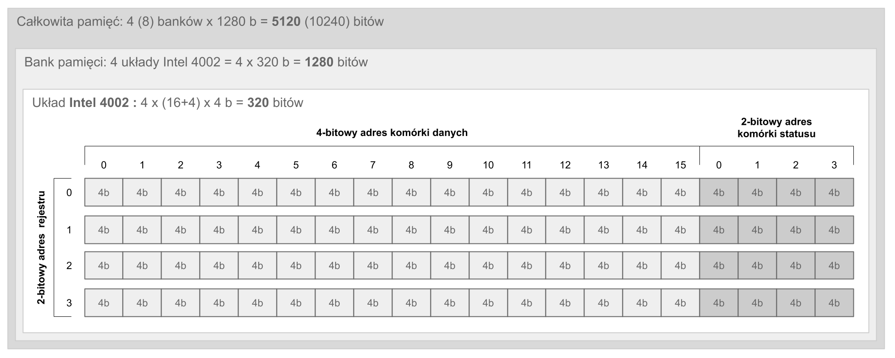

# Intel 4004 – początek czwartej generacji
Z perspektywy współczesnych 64-bitowych, wielordzeniowych mikroprocesorów nawet konstrukcje 16-bitowe wydają się archaiczne. Komputery 8-bitowe lat 70-tych i 80-tych XX wieku wyglądają jak zabawki, mające tylko wartość sentymentalną. Przy nich Intel 4004, konstrukcja 4-bitowa, prezentuje się już tylko groteskowo i prymitywnie. Jednak przy przetwarzaniu liczb dziesiętnych podstawową porcją danych jest pojedyncza cyfra, a ta daje się doskonale zapisać właśnie na 4 bitach.

## Kontekst
Istnieje znany podział rozwoju techniki komputerowej, który choć arbitralny, pozwala w pewien usystematyzowany sposób zaprezentować etapy rozwoju technologii. Jest to podział na tzw. „generacje komputerów”. Te, które poprzedzają powstanie mikroprocesora Intel 4004, podano poniżej wraz z przypisanym do każdej z nich orientacyjnym zakresem dat:

- **zerowa generacja** (do około 1942) – maszyny liczące oparte na elementach mechanicznych (np. koła zębate, przekładnie) lub elektromechanicznych (np. przekaźniki). Nie były to w sensie ścisłym komputery, lecz konstrukcje „przed komputerowe”; zalicza się do nich np. „Maszyna Różnicowa” Charlesa Babbage’a.

- **pierwsza generacja** (1942–1955) – komputery oparte na lampach elektronowych, jak np. ENIAC (uruchomienie 1945) czy UNIVAC I (1951).

- **druga generacja** (1956–1964) – komputery oparte na tranzystorach. Wprowadzenie tranzystorów spowodowało bardzo szybkie wyparcie lamp elektronowych z konstrukcji komputerów. Umożliwiło to między innymi zmniejszenie ich wymiarów, poboru mocy oraz ceny przy jednoczesnym zwiększeniu szybkości. Przykładowe konstrukcje drugiej generacji to IBM 1401(1959) czy polski ZAM-41 (1961).

- **trzecia generacja** (1964–1970) – okres układów scalonych, czyli IC (ang. *Integrated Circuit*). Procesory i całe komputery są budowane z indywidualnych układów scalonych, najczęściej bipolarnych w technologii TTL (ang. *Transistor Transistor Logic* – logika tranzystorowo-tranzystorowa), są to tak zwane „minikomputery”. Znanym minikomputerem tamtych czasów jest PDP-8 firmy DEC, z 12-bitowym słowem, pamięcią ferrytową i prędkością około 0.33 MIPS (ang. *Million Instruction Per Second* – milion instrukcji na sekundę). Inną znaną konstrukcją końca trzeciej generacji jest 8-bitowy Datapoint 2200. Architektura procesora użytego w tym komputerze, wykonanego z dyskretnych układów TTL, stała się punktem wyjścia dla późniejszego mikroprocesora Intel 8008, który był z nią niemal w pełni kompatybilny.

Za początek czwartej generacji uznaje się powstanie pierwszego mikroprocesora, gdyż to właśnie integracja wszystkich elementów procesora w jednej półprzewodnikowej mikrostrukturze decyduje o przynależności do tej generacji. Przyjmuje się, że pełnoprawne CPU (ang. *Central Processing Unit* – centralna jednostka obliczeniowa) składa się z ALU (ang. *Arithmetic Logic Unit* – jednostka arytmetyczno-logiczna), zestawu rejestrów, dekodera rozkazów oraz logiki sterującej koordynującej taktowanie, komunikację z pamięcią i układami I/O (ang. *Input/Output* – wejście/wyjście). Do tego czasu nie udało się umieścić w jednym układzie scalonym wszystkich tych komponentów.

Zwiększenie gęstości upakowania tranzystorów bipolarnych napotykało na kilka technologicznych barier, jedną z nich było odprowadzanie ciepła. Układy typu MOS (ang. *Metal Oxide Semiconductor* – metal-tlenek-półprzewodnik) dzięki niskiemu poborowi mocy pozwalały ominąć ten problem, były jednak wówczas zbyt wolne. Wprowadzenie metody SGT (ang. *Silicon Gate Technology* – technologia bramki krzemowej) umożliwiło wytwarzanie gęściej upakowanych, tańszych i szybszych układów MOS. Skutkiem tego było powstanie układów o dużym stopniu scalenia, czyli LSI (ang. *Large Scale of Integration*).

Oficjalnie Intel 4004 jest uznawany za pierwszy komercyjnie dostępny mikroprocesor, pozostały jednak w tej kwestii pewne kontrowersje. Istniała wcześniejsza, bardziej zaawansowana konstrukcja MP944, będąca pełnoprawnym mikroprocesorem, wykonanym w technologii MOS. Był to jednak element wojskowego projektu, całkowicie utajniony, wykorzystywany w systemie awioniki (CADC – ang. *Central Air Data Computer*) myśliwca F-14 Tomcat. Nie był to więc produkt komercyjny. Innym pretendentem do pierwszego miejsca był układ AL1 firmy Four-Phase Systems. Nie był to jednak CPU w pełnym tego słowa znaczeniu, zawierał tylko ALU i zestaw rejestrów, nie zawierał natomiast logiki sterującej. Nie można zapomnieć też o TMS0100 (później przemianowanym na TMS1802NC) firmy Texas Instruments. Był to w zasadzie tzw. kalkulator w jednym układzie (ang. *Calculator on a Chip*), był on też znacznie mniej wszechstronną konstrukcją od Intel 4004, a jego komercyjny debiut miał miejsce kilka miesięcy później.

## Czwarta generacja
Autorem projektu układu mikroprocesora Intel 4004 był Federico Faggin, zatrudniony w firmie Intel w kwietniu 1970 jako projektant i kierownik zespołu. W strukturze pierwszych serii tych mikroprocesorów, jako podpis, umieścił on swoje inicjały. W pełni funkcjonalny produkt został przekazany do produkcji w marcu 1971 roku. 

Początkowo Intel 4004 miał być „sercem” kalkulatora programowalnego Busicom model 141-PF; był to produkt japońskiej firmy o tej samej nazwie. Firma Intel nie zamierzała projektować mikroprocesora ogólnego przeznaczenia, miał to być projekt „skrojony” pod konkretnego kontrahenta i konkretną linię produktów. Oryginalny projekt firmy Busicom opierał się na układzie logicznym złożonym z bramek i prostych bloków funkcjonalnych, jak liczniki, zatrzaski itd. (ang. *random logic*). Był to, używając współczesnej terminologii, projekt zdefiniowany sprzętowo. Składał się z kilku układów scalonych w dużych obudowach z 36 lub 40 wyprowadzeniami, zawierających od 3000 do 5000 tranzystorów każdy. Dla porównania Intel 4004 miał 16 wyprowadzeń i składał się z około 2300 tranzystorów. 


Rysunek 1. Wersja OEM kalkulatora Busicom 141-PF

Faggin był, jak sam później przyznał, porażony poziomem komplikacji projektu opracowanego w firmie Busicom, postanowił więc przedstawić własne rozwiązanie. Pomimo tego, że projekt został zaakceptowany, firma Intel nie dostrzegła potencjału i elastyczności, jaką dawało oparcie się na oprogramowaniu, które można modyfikować bez konieczności zmian w sprzęcie. Faggin prowadził swojego rodzaju krucjatę wewnątrz firmy Intel, która ostatecznie zakończyła się sukcesem – Intel odkupił prawa do wykorzystania mikroprocesora od firmy Busicom i tak powstała 4-bitowa rodzina układów MCS-4 (ang. *Micro-Computer Set - 4*). Była to pierwsza komercyjna alternatywa dla projektów opartych na logice zdefiniowanej sprzętowo.

## Model programowy i mikroarchitektura
Należy z całą stanowczością podkreślić, że pomimo 4-bitowej architektury Intel 4004 był kompletnym mikroprocesorem, nie mającym w sobie nic z zabawki. W dalszym ciągu tego artykułu, po bardziej szczegółowym opisaniu mikroarchitektury, modelu programowego i omówieniu listy rozkazów, wszechstronny charakter tej konstrukcji stanie się widoczny. 
Pierwotnym zastosowaniem Intel 4004 miał być kalkulator wraz z całym ekosystemem i peryferiami, w związku z tym jego architektura była zorientowana na przetwarzanie pojedynczych cyfr dziesiętnych. Do tego celu doskonale nadaje się kodowanie BCD (ang. *Binary Coded Decimal* – binarnie zakodowane liczby dziesiętne), gdzie każdej cyfrze dziesiętnej odpowiada 4-bitowa liczba dwójkowa, czyli tzw. nibble – półbajt. Dlatego podstawowa porcja danych w tej architekturze ma rozmiar 4 bitów. Słowo natomiast jest zdefiniowane jako 8 bitów, czyli jeden bajt. Podstawowa charakterystyka Intel 4004 wygląda następująco:

|                                 |                                                                                           |
| ------------------------------- | ----------------------------------------------------------------------------------------: |
| data wprowadzenia do produkcji  |                                                                                1971.11.15 |
| ilość tranzystorów              |                                                                                      2300 |
| technologia                     |                                                                                     10 μm |
| częstotliwość taktowania        |                                                                                 0.740 MHz |
| cykl maszynowy                  |                                                                  10.8 μs (8 cykli zegara) |
| indeks prędkości                |                                                                                0.095 MIPS |
| dodawanie 64-bitowe             |                                                                                  613 op/s |
| rozmiar danych                  |                                                                                    4 bity |
| rozmiar instrukcji              |                                                                            8 lub 16 bitów |
| licznik programu                |                                                                                  12 bitów |
| stos adresowy                   |                                                            3 x 12 bitów (bufor cykliczny) |
| rejestry ogólnego przeznaczenia |                                                                   16 rejestrów 4-bitowych |
| akumulator                      |                                                                                    4 bity |
| flagi                           |                                                                         C – przeniesienie |
| pamięć programu                 |                                                                   4 KiB (12-bitowy adres) |
| pamięć RAM                      |                   620 B (1280 x 4b) – bezpośrednio, 1240 B (2560 x 4b) – z zew. dekoderem |
| porty wyjściowe                 |                                      64 bity – bezpośrednio, 128 bitów – z zew. dekoderem |
| porty wejścia/wyjścia           |                                                                                   64 bity |
| całkowita liczba instrukcji     |                                                                                        46 |
| architektura                    | oddzielna pamięć danych i programu (Harwardzka) z multipleksowaną szyną danych i programu |
|                                 |                                                                                           |

Parametry ilościowe, jak np. indeks prędkości, są podane orientacyjnie lub prezentują wartości maksymalne. Porównywanie ilościowe różnorakiego rodzaju mikroprocesorów zawsze nastręcza trudności, ma charakter przybliżony i mocno zależy od konkretnych przypadków użycia. Poglądowy schemat architektury wewnętrznej zaprezentowano na Rysunku 2. 


Rysunek 2. Schemat blokowy architektury mikroprocesora Intel 4004

Do stworzenia kompletnego, uniwersalnego systemu komputerowego, oprócz mikroprocesora, potrzebne są jeszcze układy zewnętrzne, takie jak pamięć danych, pamięć programu oraz układy wejścia/wyjścia. W związku z tym powstała rodzina układów pod wspólną nazwą MCS-4. Składała się ona z następujących elementów:

- 4001 – programowana na etapie produkcji (ang. mask-programmable) pamięć ROM o organizacji 256 x 8-bitów zawierająca również 4-bitowy port wyjściowy.

- 4002 – statyczna pamięć RAM o pojemności 320 bitów, zorganizowana jako 4 rejestry po 16 + 4 komórki, o pojemności 4-bitów każda. Sposób adresowania tej pamięci opisany jest poniżej, natomiast organizację wewnętrzną pokazano na Rysunku 3.

- 4003 – jest to 10-bitowy, statyczny rejestr przesuwny z szeregowym wejściem i równoległym wyjściem. Stosowany do zwiększenia liczby portów wyjściowych służących do sterowania urządzeń zewnętrznych.

- 4004 – sam omawiany mikroprocesor, reklamowany wówczas jako 4-bitowy i równoległy. W tamtych czasach istniały procesory szeregowe, przetwarzające jednocześnie nawet tylko jeden bit. Łączono je w agregaty w celu przetwarzania słów o większej długości. W tym kontekście podkreślenie w ulotce reklamowej „równoległości” staje się bardziej zrozumiałe.

Dodatkowo oferowano również układy tzw. „logiki klejącej” (ang. glue logic), jak interfejsy do standardowych modułów pamięci Intela, układy sterowania klawiaturą czy wyświetlaczem. W różnych wersjach były to np: 4008, 4009, 4269, 4289.

Standardowym rozmiarem instrukcji jest 8-bitów, dlatego w przypadku ROM komórka pamięci ma jeden bajt. Pamięć ROM zorganizowana jest w formie pojedynczego banku, zawierającego 16 układów Intel 4001, każdy z nich zawiera 256 bajtów pamięci. Daje to w sumie 4 KiB.

O ile pamięć programu (ROM) jest adresowana w jednolity sposób, za pomocą 12-bitowego adresu, to dostęp do pamięci danych (RAM) oraz portów zewnętrznych jest realizowany w sposób dużo bardziej skomplikowany. Pojedyncze moduły pamięci są logicznie pogrupowane w tzw. banki – każdy bank zawiera 4 układy. Cały system może zawierać maksymalnie 8 takich banków. Jednak do osiągnięcia maksymalnej liczby banków konieczne jest wykorzystanie układów pomocniczych, samodzielnie Intel 4004 może obsłużyć do 4 banków. 


Rysunek 3. Struktura pamięci danych (RAM) w systemie MCS-4

Adresowanie pamięci podzielone jest na etapy. W pierwszej kolejności numer banku wystawiany jest za pomocą instrukcji DCL na zewnętrzne linie CM-RAM0..3, co bezpośrednio umożliwia wybranie jednego z czterech układów Intel 4002.

Jak pokazano na Rysunku 3, pojedynczy układ pamięci RAM podzielony jest logicznie na cztery rejestry. Pojedynczy rejestr jest natomiast zaprojektowany tak, by dało się w nim zapamiętać wielocyfrową, dziesiętną liczbę w kodzie BCD. Zgodnie z pierwotnymi założeniami projektu podstawową funkcjonalnością miało być dokonywanie obliczeń na liczbach dziesiętnych, całkowitych i zmiennoprzecinkowych. Te ostatnie nie są realizowane sprzętowo, jednak układ pamięci jest zaprojektowany tak, by ułatwić ich programową implementację.


Rysunek 4. Struktura rejestru danych i przykład jej wykorzystania do przechowywania liczby zmiennoprzecinkowej ze znakiem

Porty wejścia/wyjścia są zintegrowane z układami pamięci RAM i ROM. Każdy z nich ma jeden 4-bitowy port: w przypadku RAM (Intel 4002) jest to port wyjściowy, w przypadku ROM (Intel 4001) jest to port wejścia/wyjścia. Do zaadresowania portu w pamięci RAM wystarczy więc wybranie banku i układu, natomiast w przypadku ROM tylko samego układu.


Rysunek 5. Sposoby adresowania komórek danych i statusu w pamięci RAM oraz portów zintegrowanych z modułami pamięci RAM i ROM

Sam model programowy ISA (ang. Instruction Set Architecture) nie jest bardzo rozbudowany, jest jednak na tyle złożony, że można by, zdaniem autora, zaliczyć go do klasy CISC (ang. Complex Instruction Set Computing – złożony zestaw instrukcji przetwarzania). Jest tak między innymi dlatego, że występują w nim instrukcje operujące bezpośrednio na komórkach pamięci (a nie tylko rejestrach) oraz instrukcje złożone, realizujące więcej niż jedną funkcjonalność. 

W czasach początku ery procesorów i mikroprocesorów oprogramowanie tworzyło się głównie w assemblerze, dlatego projektanci architektur starali się uczynić właśnie assembler najbardziej wygodnym dla człowieka, oferując różne wyspecjalizowane instrukcje. Jak najwięcej funkcjonalności starano się zaimplementować sprzętowo. Stąd wziął się, nieintuicyjny być może, kierunek ewolucji architektur: od CISC do RISC (ang. Reduced Instruction Set Architecture – architektura o zredukowanej liczbie instrukcji), czyli od bardziej złożonych do prostszych. Główną przyczyną tego trendu jest rozwój kompilatorów i optymalizacji generowanego kodu. Współczesny programista nie ma praktycznie styczności z assemblerem, w związku z tym architektury procesorów i ich modele programowe są zoptymalizowane pod kątem kompilatora, a nie człowieka.

Na elementy mikroarchitektury Intel 4004 składają się między innymi następujące komponenty:

rejestry robocze/indeksowe – 16 rejestrów 4-bitowych o numerach od 0 do 15, dostępnych również jako pary numerowane od 0P do 7P w operacjach 8-bitowych. Stosowana bywa również notacja R0...R15 dla rejestrów oraz P0...P7 dla par.

- akumulator – 4-bitowy rejestr przechowujący wartość ostatniej operacji wykonanej przez jednostkę arytmetyczno-logiczną (ALU). Pełni również inne funkcje.

- znacznik przeniesienia – tzw. znacznik C (ang. carry – przeniesienie), ustawiany w wyniku wykonania odpowiednich instrukcji ALU. Informacja o tym, czy dana instrukcja zmienia znacznik C, jest zawarta w dokumentacji mikroprocesora. Stosowany w wielocyfrowych operacjach arytmetycznych, przesunięciach oraz skokach warunkowych.

- licznik programu – 12-bitowy licznik programu, którego aktualna wartość dostępna jest zazwyczaj w kodzie assemblera jako „*”.

sprzętowy stos adresowy i wskaźnik stosu - bufor cykliczny o pojemności (wielkości) 3 adresów 12-bitowych. Operacje na stosie wykonywane są tylko w odniesieniu do aktualnie wskazywanego przez wskaźnik stosu adresu.

wybrany bank pamięci RAM – 3-bitowy numer banku pamięci RAM, do którego będą odwoływały się wszystkie instrukcje dostępu. Ustawiany za pomocą instrukcji DCL. Raz ustawiony numer banku jest pamiętany aż do następnej instrukcji DCL lub wystąpienia resetu.

wybrany adres pamięci RAM, ROM lub portu I/O – 8-bitowy adres, którego interpretacja zależy od tego, w kontekście jakiego zasobu (np. pamięci lub portu) jest użyty. Schemat adresowania pokazany jest na Rysunku 5. Adres ustawiany jest za pomocą instrukcji SRC i jest pamiętany aż do kolejnej takiej instrukcji lub wystąpienia resetu.

Instrukcje mają rozmiar 8 lub 16 bitów, pobranie jednego bajtu z pamięci ROM i jego przetworzenie zabiera jeden pełny cykl maszynowy. Dlatego czas wykonania instrukcji 8-bitowych wynosi jeden cykl maszynowy, a 16-bitowych dwa. Format instrukcji pokazany jest na Rysunku 6.


Rysunek 6. Format instrukcji 8-bitowych i 16-bitowych

Korzystając z faktu, że Intel 4004 jest konstrukcją prostą i dobrze udokumentowaną, a przy tym w pełni funkcjonalną, można się pokusić o zaprezentowanie szczegółów podstawowego cyklu maszynowego (patrz Rysunek 7).


Rysunek 7. Pojedynczy cykl maszynowy Intel 4004 i jego składowe podcykle

Cykl maszynowy składa się z ośmiu podcykli, każdy z nich trwa dokładnie jeden cykl zegarowy, czyli około 1.35 µs dla zegara 0.74 MHz. 

W pierwszej fazie mikroprocesor ustawia stan wyjścia SYNC, co informuje układy zewnętrzne, w szczególności ROM i RAM, o rozpoczęciu nowego cyklu maszynowego. Faza ta obejmuje podcykle A1 , A2  , A3 w których mikroprocesor wysyła do pamięci ROM  adres do pobrania kolejnej instrukcji programu. Kolejno w podcyklach wysyłane są 4-bitowe porcje adresu od najmniej do najbardziej znaczącego nibbla (ang. nybble – 4-bitowa porcja danych, półbajt). W tej fazie kontrolę nad szyną danych ma mikroprocesor.

Po otrzymaniu adresu pamięć ROM dokonuje odczytu znajdującego się pod nim bajtu. Następnie ROM przejmuje kontrolę nad szyną danych i wystawia na nią odczytany bajt w dwóch kolejnych podcyklach. W podcyklu M1 do CPU wysyłany jest półbajt OPR, a po nim, w podcyklu M2 , wysyłany jest półbajt OPA. Jeśli OPR reprezentuje instrukcję I/O, to wartość OPA wysyłana jest również do odpowiedniego układu RAM lub ROM, w którym znajduje się żądany port.

Kolejne trzy podcykle, czyli X1 , X2 , X3 , to faza wykonania instrukcji. W podcyklu X1 kontrolę nad szyną danych przejmuje CPU i wystawia na nią zawartość kodu instrukcji OPA. Prawdopodobnie jest to skutek uboczny mikroarchitektury i nie ma udokumentowanego, praktycznego zastosowania. W kolejnym podcyklu X2, jeśli OPR reprezentuje instrukcję odczytu z pamięci lub portu wejściowego, to kontrolę nad szyną danych przejmuje wybrany moduł 4001 lub 4002 i wystawia na nią odczytaną wartość. Wartość tą odczytuje CPU. W przeciwnym wypadku kontrolę nad szyną danych przejmuje CPU i jeśli instrukcja tego wymaga, może wystawić na nią 4-bitowy argument. W podcyklu X3 CPU ma kontrolę nad szyną danych i w przypadku instrukcji SRC wystawia na nią bardziej znaczący półbajt adresu RAM lub ROM.

W przypadku instrukcji 16-bitowych po pierwszym cyklu maszynowym następuje drugi, co zostało pokazane na Rysunku 6.

Przegląd instrukcji z podziałem na kategorie

Wszystkie jednobajtowe instrukcje zajmują jeden cykl maszynowy, a dwubajtowe dwa cykle. O ile nie podano inaczej, opisane poniżej instrukcje są jednobajtowe. 

Instrukcje wykorzystujące pojedyncze rejestry indeksowe lub ich pary:

FIN <para> – pobierz pośrednio (ang. fetch indirect). Pobierz i wpisz do akumulatora zawartość komórki pamięci, której 8-bitowy adres zawiera wskazana para rejestrów.

INC <rejestr> – zwiększ o jeden (ang. increment – zwiększenie) wskazany 4-bitowy rejestr indeksowy.

Instrukcje wykorzystujące akumulator oraz rejestry indeksowe:

ADD <rejestr> – dodaj (ang. add) zawartość rejestru do akumulatora wraz z przeniesieniem, wynik umieść w akumulatorze.

SUB <rejestr> – odejmij (ang. subtract) zawartość rejestru od akumulatora wraz z pożyczką, wynik umieść w akumulatorze.

LD <rejestr> – załaduj (ang. load) do akumulatora zawartość wskazanego rejestru.

XCH <rejestr> – wymień (ang. exchange) zawartość akumulatora i wskazanego rejestru.

Instrukcje operujące na akumulatorze:

CLB – zeruj akumulator i znacznik przeniesienia (ang. clear both – wyczyść oba).

CLC – zeruj znacznik przeniesienia (ang. clear carry), czyli wpisz do niego wartość 0.

STC – ustaw znacznik przeniesienia (ang. set carry), czyli wpisz do niego wartość 1.

IAC – zwiększ zawartość akumulatora o jeden.

DAC – zmniejsz zawartość akumulatora o jeden (ang. decrement – zmniejszenie).

CMC – zaneguj znacznik przeniesienia (ang. complement carry).

RAL – obróć zawartość akumulatora w lewo poprzez znacznik przeniesienia (ang. rotate accumulator left).

RAR – obróć zawartość akumulatora w prawo poprzez znacznik przeniesienia (ang. rotate accumulator right).

TCC – prześlij znacznik przeniesienie i wyzeruj go (ang. transmit carry and clear). Instrukcja przepisuje zawartość znacznika przeniesienia, czyli 1 lub 0, do akumulatora, a następnie zeruje znacznik przeniesienia przez wpisanie do niego 0.

TCS – prześlij przeniesienie z odejmowania (ang. transfer carry subtract). Instrukcja wykorzystywana przy odejmowaniu wielocyfrowych liczb w kodzie BCD. Jeśli jest przeniesienie, wpisz do akumulatora wartość 10 – w przeciwnym razie 9.

DAA – wykonaj korektę dziesiętną wartości akumulatora (ang. decimal adjust accumulator). Instrukcja stosowana przy operacjach na liczbach w kodzie BCD.

KBP – przetwarzanie danych z klawiatury (ang. keyboard process). Jedna z bardziej egzotycznych instrukcji, ułatwiająca dekodowanie numeru wciśniętego klawisza na klawiaturze matrycowej. Jeśli akumulator ma ustawiony tylko jeden bit, jego zawartość jest zamieniana na numer tego bitu. Jeśli jest ustawiony więcej niż jeden bit, zawartość akumulatora ustawiana jest na 0b1111. Jeśli żaden bit nie jest ustawiony, zawartość akumulatora ustawiana jest na 0.

Instrukcje operujące na danych natychmiastowych (literałach):

FIM <para> <bajt> – wpisz bajt podany w kodzie instrukcji (ang. fetch immediate – pobierz natychmiastowo) do wybranej pary rejestrów. Instrukcja jest dwubajtowa.

LDM <półbajt> – załaduj akumulator 4-bitową wartością podaną w kodzie instrukcji (ang. load immediate).

Instrukcje skoków:

JUN <adres> – skocz bezwarunkowo (ang. jump unconditionally). Skocz pod podany w kodzie instrukcji 12-bitowy adres. Instrukcja jest dwubajtowa.

JIN <para> – skocz pośrednio (ang. jump indirect). Skocz bezwarunkowo pod adres, w którym mniej znaczące 8-bitów aktualnej wartości licznika rozkazów jest zamienione na wartość podanej pary rejestrów. Jest to tzw. skok w ramach jednej, 8-bitowej „strony” adresowej.

JCN <warunek> <adres> – skocz, jeśli warunek jest spełniony (ang. jump on condition). Jest to interesująca i wszechstronna instrukcja. Podany warunek jest 4-bitową liczbą, w której ustawienie odpowiedniego bitu ma następujące znaczenie:

bit 0 : wartość wejściowego pinu „test” mikroprocesora jest równa 0.
bit 1 : wartość znacznika przeniesienia jest równa 1.
bit 2 : wartość akumulatora jest równa 0.

Jeśli bit 3 ma wartość 0, skok następuje, kiedy przynajmniej jeden z warunków jest spełniony (funkcja or), w przeciwnym razie skok następuje, kiedy żaden z warunków nie jest spełniony (funkcja nor). Skok następuje pod wskazany w kodzie instrukcji 8-bitowy adres, w ramach tej samej strony adresowej. Instrukcja jest dwubajtowa.

ISZ <rejestr> <adres> – zwiększ o jeden i skocz (omiń), jeśli zero (ang. increment and skip if zero). Wskazany rejestr jest zwiększany o jeden i jeśli po tej operacji wynosi zero, wykonywany jest skok w ramach strony adresowej, na podany w instrukcji 8-bitowy adres. Instrukcja jest dwubajtowa.

JMS <adres> – skocz do podprogramu (ang. jump to subroutine). Adres następnej instrukcji jest odkładany na stos adresowy, następnie wykonywany jest skok pod 12-bitowy adres podany w kodzie instrukcji.

BBL <półbajt> – załaduj akumulator podaną w instrukcji wartością, zdejmij ze stosu ostatni adres i wykonaj skok pod ten adres (ang. branch back and load – powróć z podprogramu i załaduj). Jest to standardowa instrukcja kończąca podprogram oraz umożliwiająca zwrócenie jego statusu (wyniku).

Instrukcje sterujące dostępem do pamięci i portów I/O:

DCL – wybierz aktywny bank pamięci RAM. Najmniej znaczące 3-bity akumulatora wybierają aktualnie aktywny bank pamięci RAM (ustawiają pośrednio stan pinów CM-RAM0..3 mikroprocesora). Wybrany bank zostaje zapamiętany aż do kolejnej instrukcji DCL lub resetu.

SRC <bajt> – ustaw najmniej znaczące 8-bitów rejestru wybierającego adres pamięci RAM, ROM lub portu szeregowego. Interpretacja podanego adresu zależy od rodzaju pamięci lub portu, do którego dostęp chcemy w kolejnych instrukcjach uzyskać (patrz Rysunek 5). Wybrany adres zostaje zapamiętany aż do kolejnej instrukcji SRC lub resetu.

RDM – załaduj do akumulatora komórkę danych z pamięci RAM (ang. read data RAM character).

RD<n> – załaduj do akumulatora komórkę statusu o adresie <n> z pamięci RAM (ang. read data RAM status character). Np. RD1 ładuje komórkę statusu o adresie 1.

WR<n> – wpisz zawartość akumulatora do komórki statusu w pamięci RAM o adresie <n> (ang. write data RAM status character). Na przykład WR0 wpisuje do komórki statusu o adresie 0 wartość akumulatora.

RDR – załaduj do akumulatora stan portu w module pamięci ROM (ang. read ROM port).

WRM – wpisz zawartość akumulatora do pamięci danych RAM (ang. write data RAM character).

WMP – wpisz zawartość akumulatora do portu wyjściowego wybranego modułu pamięci RAM (ang. write RAM port).

WRR – wpisz zawartość akumulatora do portu wyjściowego wybranego modułu pamięci ROM (ang. write ROM port).

WPM – wpisz zawartość akumulatora do komórki pamięci program RAM (ang. write program RAM). Wybrany adres musi być adresem pamięci RAM, wpisywany jest bardziej znaczący półbajt, mniej znaczący wpisywany jest kolejną instrukcją WPM. Dodatkowo dostęp do zapisu pamięci programu musi zostać odblokowany, szczegółowa sekwencja rozkazów opisana jest w podręczniku dla programisty (patrz „Źródła i bibliografia”, pozycja 2).

ADM – dodaj do akumulatora zawartość komórki pamięci danych RAM wraz z przeniesieniem (ang. add data RAM to accumulator with carry).

SBM – odejmij od akumulatora zawartość komórki pamięci danych RAM wraz z pożyczką (ang. subtract data RAM from accumulator with borrow).

Ostatnią instrukcją jest wspierana chyba przez każdy istniejący procesor instrukcja NOP, która nie wykonuje żadnej operacji (ang. no operation) i służy zazwyczaj do generowania precyzyjnych opóźnień czasowych.

Na zakończenie omawiania instrukcji krótki fragment kodu, który pokazuje sekwencję dostępu do pamięci danych RAM:
```assembly
		LDM 2			; załaduj do akumulatora wartość 2
		DCL 			; wybierz bank pamięci RAM numer 2
		FIM 0P 180		; ładuj liczbę 180 do pary rejestrów 0,1
		SRC 0P 			; ustaw adres na wartość pary 0,1 
						; dla pamięci RAM oznacza to:
						;   numer układu RAM: 2,
						;   adres rejestru: 3, 
						;   adres komórki: 4
		LDM 12 			; wpisz do akumulatora wartość 12
		WRM 			; wpisz wartość akumulatora do wybranej komórki RAM
```
Jak widać, dostęp do pamięci ROM, RAM i portów I/O musi być każdorazowo poprzedzony ustawieniem odpowiedniego banku pamięci (w przypadku RAM) za pomocą instrukcji DCL oraz 8-bitowego adresu za pomocą instrukcji SRC. 

## Prosty benchmark

W celu porównania wydajności różnego rodzaju procesorów i całych systemów komputerowych wymyślono już wiele różnych procedur testowych i metodologii pomiarowych. Najprostszą metodą jest podanie średniej lub maksymalnej liczby instrukcji na sekundę, ma to zazwyczaj bezpośredni związek z czasem trwania cyklu maszynowego, a więc i czasem dostępu do pamięci zewnętrznej. Drugim podejściem jest pomiar czasu wykonania jakiejś, w miarę standardowej i powszechnie wykorzystywanej, funkcjonalności.

Na potrzeby tego artykułu została wybrana procedura dodająca liczby binarne składające się z szesnastu półbajtów. Realizuje więc operację pojedynczego, 64 bitowego, binarnego dodawania. Przed wywołaniem argumenty muszą być umieszczone w pamięci RAM pod adresami 0x00 i 0x10. Wynik zostanie umieszczony pod adresem 0x10. Para rejestrów 2P zawiera wskaźnik do aktualnie dodawanego półbajtu pierwszego argumentu, a 3P do drugiego.

```assembly
		FIM 2P 0		; para 2 <- adr. początku pierwszego argumentu
		FIM 3P 16		; para 3 <- adr. początku drugiego argumentu
		CLB				; wyzeruj akumulator i znacznik przeniesienia
		XCH 8			; wyzeruj rejestr 8 - licznik półbajtów
NAST 	SRC 2P			; wybierz adres półbajtu pierwszego argumentu
		RDM				; załaduj wybrany półbajt do akumulatora
		SRC 3P			; wybierz adres półbajtu drugiego argumentu
		ADM				; dodaj wybrany półbajt do akumulatora
		WRM				; zapisz wynik w miejsce półbajtu drugiego argumentu
		INC 5			; zwiększ adres półbajtu pierwszego argumentu
		INC 7			; zwiększ adres półbajtu drugiego argumentu
		ISZ 8 NAST		; zwiększ licznik półbajtów, jeśli < 16 skocz do NAST
		BBL 0			; powrót z podprogramu z kodem 0
```
Sumaryczny czas wykonania to, jak można obliczyć, 2 + 2 + 1 + 1 + 16 x (1 + 1 + 1 + 1 + 1 + 1 + 1 + 2) + 1 = 151 cykli maszynowych. Daje to około 613 dodawań 64-bitowych na sekundę.

## Następcy

Linia 4-bitowych procesorów firmy Intel miała jeszcze tylko jednego następcę: Intel 4040. Była to konstrukcja zgodna binarnie z Intel 4004 i mająca taką samą wydajność. Powstała również rodzina układów MCS-40, z którą także Intel 4004 był zgodny. Główną motywacją jej wprowadzenia był sukces rynkowy MCS-4 i chęć dostarczenia lepszego i tańszego produktu, jednak z zachowaniem całkowitej zgodności z poprzednikiem. Miało to na celu zabezpieczenie zdobytego już raz rynku bez inwestowania zbyt wiele pracy badawczej w technologię 4-bitową, którą już wtedy uważano za pozbawioną przyszłości. Główne ulepszenia zastosowane w Intel 4004 nie wprowadzały więc nowej jakości, poprawiały tylko parametry tam, gdzie było to w miarę łatwe i efektowne. Zmiany te były następujące:

- zwiększenie liczby rejestrów indeksowych z 16 do 24 przez wprowadzenie bankowania.

- dodanie obsługi przerwań.

- zwiększenie przestrzeni adresowej pamięci programu ROM z 4 do 8 KiB przez wprowadzenie bankowania.

- zwiększenie liczby instrukcji z 46 do 60. Dodano instrukcje kontrolujące pracę krokową, obsługę bankowania pamięci ROM oraz rejestrów, a także instrukcje bezpośredniego odczytu pamięci programu oraz rejestru sterującego wyborem banków pamięci. Wprowadzono także instrukcje blokowania i odblokowania przerwań, powrotu z przerwania oraz instrukcje logiczne operujące bezpośrednio na wybranych rejestrach indeksowych.

- zwiększono rozmiar stosu adresowego z 3 do 7 poziomów.

Wskutek tego liczba wyprowadzeń mikroprocesora wzrosła z 16 do 24, a liczba tranzystorów w jego strukturze do 3000. Wprowadzenie Intel 4040 i rodziny MCS-40 miało miejsce w 1974 roku, trzy lata po premierze jego poprzednika. Jednak już w 1972 roku miała miejsce premiera mikroprocesora 8-bitowego, Intel 8008, który miał wytyczyć nowy kierunek. 

Mikroprocesory zorientowane głównie na liczby składające się z cyfr oraz na operacje na nich odchodziły do przeszłości. Przyszłością były konstrukcje zorientowane na znaki alfanumeryczne, co najmniej 8-bitowe, z możliwością adresowania większych rozmiarów pamięci i stosowania bardziej uniwersalnych urządzeń peryferyjnych. Dzięki postępowi technologicznemu możliwe stało się tworzenie układów scalonych o coraz większej skali integracji, które pracowały szybciej i były coraz tańsze. Dało to początek swoistej ewolucji, która do dnia dzisiejszego toczy się na naszych oczach.

Mikroprocesor Intel 4040 był ostatnim z rodziny 4-bitowych procesorów firmy Intel, któryc	h produkcja została ostatecznie zakończona w roku 1981. Czyli dokładnie 10 lat od debiutu prekursora czwartej generacji.

## Źródła i bibliografia

W powstaniu niniejszego artykułu wykorzystane zostały następujące publikacje i źródła:

„4004 SINGLE CHIP 4-BIT P-CHANNEL MICROPROCESSOR”, Intel Corporation, publikacja: 1987.
„MCS-4 Assembly Language Programming Manual”, Preliminary Edition, Intel Corporation, 1973.
„MCS-40 User’s Manual For Logic Designers”, Intel Corporation, 1974.
„MCS-4 Micro Computer Set”, Intel Corporation, 1971.
Joyrup Bhattacharya, „Rudiments of MODERN COMPUTER APPLICATION”, Academic Publishers, 2014.
emulator i opis instrukcji Intel 4004/MCS-4: http://e4004.szyc.org/index_pl.html.
Wikipedia – wikipedia.org
Wikichip – wikichip.org
The CPUShack – cpushack.com

